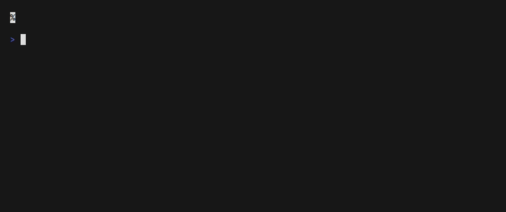

<div align="center">

# eta

Next departures of a public-transport route at a stop, from your terminal, in any supported city.


</div>

## Contents

- [Motivation](#motivation)
- [What it is, and what it is not](#what-it-is-and-what-it-is-not)
- [Countries and towns](#countries-and-towns)
- [Features](#features)
  - [Every line at a stop](#every-line-at-a-stop)
  - [One route, with clock times](#one-route-with-clock-times)
  - [A route's stops, in order](#a-routes-stops-in-order)
  - [Ambiguous stop? Pick one](#ambiguous-stop-pick-one)
  - [Live board](#live-board)
  - [JSON for scripts and status bars](#json-for-scripts-and-status-bars)
  - [Default city and aliases](#default-city-and-aliases)
  - [Key setup and health check](#key-setup-and-health-check)
- [Install](#install)
- [Usage](#usage)
- [API keys](#api-keys)
- [Config and aliases](#config-and-aliases)
- [JSON output](#json-output)
- [How it works](#how-it-works)
- [Development](#development)
- [License](#license)

## Motivation

I often code right before leaving the comfort of my house to venture into the city, and was frustrated that I had to tackle multiple rounds of auth hurdles `(unlock phone -> auth app -> find my bus on the map/UI)` to check the departure of my bus next to my house. For easing the pain I built [GoKK](https://github.com/bancsdan/GoKK), which works in Budapest where I live. Install tool, save an alias, and I can get the next departure in a second every time.

This tool is a successor of `GoKK`, with multi-city support, and a similar UX. This tool aims to ease the pain for my fellow terminal users in other cities and myself when traveling for work.

## What it is, and what it is not

`eta` answers one question: **when does the next one leave from my stop?** It is built for the stop you already know: the one outside your door, your office, your hotel. You type its name and get the board, either every line at that stop or just the route you care about.

It is **not a journey planner**. It will not route you from A to B, pick a stop near you, handle transfers or tell you how long the ride takes. The closest it gets is `-l`, which lists a route's stops in order so you can find the right name to type. For anything more, use the operator's own app or a general planner; `eta` is what you reach for once you know where you need to board.

## Countries and towns

Every command names a country and a town: `eta norway halden 34 bussterminal`. The town scopes the search; it is not part of the stop name. Where the provider covers a whole country, every town in it works. Single-city APIs accept only that city as the town.

`eta countries` prints this table for the build you have; `eta cities <country>` lists the towns eta probes regularly (with their ids and aliases); `eta cities --check` makes one real request per probed town.

| Country (id) | Towns | Provider | Key | Notes |
|---|---|---|---|---|
| Finland (`finland`, `fi`) | every town | `digitransit` ([Digitransit](https://digitransit.fi/en/developers/)) | `ETA_DIGITRANSIT_API_KEY`, required | not yet verified against the live API |
| Germany (`germany`, `de`) | every town in Berlin and Brandenburg | `bvg` (community-run [v6.bvg.transport.rest](https://v6.bvg.transport.rest)) | none | stop search only; the upstream service has outages |
| Hungary (`hungary`, `hu`) | Budapest | `bkk` ([BKK FUTÁR](https://opendata.bkk.hu)) | `ETA_BKK_API_KEY`, required | |
| Norway (`norway`, `no`) | every town | `entur` ([Entur](https://developer.entur.no) national API) | none | routes are matched to the town's operator, so `-l` works anywhere |
| Sweden (`sweden`, `se`) | Stockholm and the SL region | `sl` ([SL Transport](https://www.trafiklab.se/api/our-apis/sl/transport/)) | none | stop list downloaded on first run; stop search only |
| Switzerland (`switzerland`, `ch`) | every town | `opendatach` ([transport.opendata.ch](https://transport.opendata.ch)) | none | stop search only |
| United Kingdom (`uk`, `gb`) | London | `tfl` ([TfL Unified API](https://api-portal.tfl.gov.uk)) | `ETA_TFL_API_KEY`, optional | tube, bus, DLR, Overground lines by name, Elizabeth line, tram |
| United States (`usa`, `us`) | Boston, New York City | `mbta` ([MBTA v3](https://api-v3.mbta.com)), `mta` ([MTA GTFS-Realtime](https://api.mta.info/)) | `ETA_MBTA_API_KEY` optional; MTA none | Boston: keyless is ~20 req/min. New York: subway only, 5 MB timetable download on first run, no timetable fallback |

"Stop search only" means the API has no route → stops call, so `-l` is unavailable there and a route is matched against the stop's board instead.

Planned next: Paris, Prague, Washington DC, Chicago, Portland, Vancouver, Singapore, Melbourne, Tokyo, Sydney, SF Bay Area, Los Angeles.

## Features

### Every line at a stop

Give a city and a stop name and you get the whole board, grouped by line and direction, next departure first. Stop names are matched fuzzily and accent-insensitively (`viranyos` finds `Virányos út`, `jernbanetorget` finds `Jernbanetorget, Oslo`).

```sh
eta norway bergen "bergen busstasjon"
```


### One route, with clock times

Add the route to see only that line. `-c N` shows N departures per direction and `-t` adds the clock time next to the countdown. `~` marks entries that come from the timetable rather than a live prediction.

```sh
eta usa boston Red "park street" -c 3 -t
```


### A route's stops, in order

`-l` lists every stop of a route per direction, in travel order, so you can find the exact name to type. Not a journey planner, just the list of stops.

```sh
eta uk london Central -l
```


### Ambiguous stop? Pick one

When a name matches several stops, eta asks on the terminal. Piped, it takes the search API's best hit and prints the alternatives on stderr. With a route given, stops the route does not serve are dropped first, which usually settles it without asking.

```sh
eta norway oslo grorud
```



### Live board

`-w` keeps the board on screen and refreshes it every 30 seconds (`--every N` to change). Ctrl-C stops it.

```sh
eta norway stavanger 1 hillevåg -w --every 5
```


### JSON for scripts and status bars

`-j` prints the same board as JSON: RFC 3339 times, seconds until departure, and whether each entry is live. See [JSON output](#json-output) for the schema.

```sh
eta norway trondheim 3 dragvoll -j
```


### Default city and aliases

Set `default_country` and `default_town` once and skip both arguments. Aliases bake in a whole command line, so your commute is `eta` and your office is `eta work`. See [Config and aliases](#config-and-aliases).

```sh
eta          # runs the "default" alias
eta work -c 2
```


### Key setup and health check

`eta countries` summarises coverage per country and `eta cities <country>` lists a country's verified towns with their ids, provider, readiness and where to get a key; `eta cities --check` makes one real request per town. `eta <country> <town> --setup` prompts for the key and writes it to the keys file.

```sh
eta cities --check
eta hungary budapest --setup
```

## Installation

Homebrew (macOS and Linux):

```sh
brew install bancsdan/tap/eta
```

Prebuilt binaries for macOS, Linux and Windows are attached to every [GitHub release](https://github.com/bancsdan/eta/releases). With Go 1.26+ installed:

```sh
go install github.com/bancsdan/eta/cmd/eta@latest
```

`eta --version` prints the version, commit and build date of the binary you have.

## Usage

```
eta <country> <town> <stop-query> [-c N] [-t] [-j] [-r] [-w]   every line at the stop
eta <country> <town> <route> <stop-query> [flags]              one route
eta <country> <town> <route> -l [-j]                           the route's stops
eta <town> ...                                                 with default_country set
eta <route> <stop-query>                                       with default_country and default_town set
eta <alias> [flags]
eta <country> <town> --setup                                   save the provider's API key
eta countries | eta cities [<country>] [--check]
```

After the country and town, one positional is a stop query and two are a route and a stop.

| Flag | Meaning |
|---|---|
| `-c`, `--count N` | number of departures to show per direction (default 1) |
| `-t`, `--times` | also print clock times, e.g. `5m42s (22:41)` |
| `-j`, `--json` | print JSON instead of text |
| `-l`, `--list` | list the route's stops by direction instead of departures |
| `-r`, `--refresh` | ignore the route/stop cache (`~/.cache/eta/<provider>/<town>`) |
| `-w`, `--watch` | keep the board on screen, refreshing every 30 s (`--every N` seconds to change) |
| `-a`, `--aliases` | show the configured aliases and exit |
| `--setup` | prompt for the city's API key(s) and save them to the keys file |

Flags may appear anywhere. Times are real-time predictions; `~` marks schedule-only entries. Colour is dropped when piped or under `NO_COLOR`.

```
$ eta usa boston Red "park street" -c 2 -t
Park Street
Red → Ashmont
  4m31s (21:02)  13m40s (21:11)
Red → Braintree
  34s (20:58)    9m46s (21:08)
Red → Alewife
  45s (20:58)    5m35s (21:03)

$ eta oslo 31 jernbanetorget
Jernbanetorget
31 → Grorud T
  8m1s
31 → Snarøya
  7s
```

Stop queries are accent-insensitive and fuzzy (`picca` matches `Piccadilly Road`). When a query matches several stops, `eta` asks you to pick one. Cities without a `route:stops` call (Berlin) search stops by name instead; if several hits carry the route and you can't be asked, the search API's top hit is used and the alternatives are printed on stderr.

## API keys

API keys are read from `ETA_<PROVIDER>_API_KEY` or from `$XDG_CONFIG_HOME/eta/keys` (`~/.config/eta/keys`), one `provider = key` per line:

```
bkk = 0123abcd-...
tfl = ...
```

If both set, the environment variable wins. Providers with several keys use `ETA_<PROVIDER>_<LABEL>_API_KEY` and `provider_label = ...`. `eta <country> <town> --setup` prompts for the key and writes the file for you. A key is only ever sent to that provider's API; `ETA_DEBUG=1` logs every request with keys masked.

| Provider | Cities | Variable | Keys-file name | Needed? | Where to get it |
|---|---|---|---|---|---|
| `bvg` | Berlin, Potsdam | none | | no | |
| `mbta` | Boston | `ETA_MBTA_API_KEY` | `mbta` | optional | https://api-v3.mbta.com/register |
| `bkk` | Budapest | `ETA_BKK_API_KEY` | `bkk` | required | https://opendata.bkk.hu |
| `tfl` | London | `ETA_TFL_API_KEY` | `tfl` | optional | https://api-portal.tfl.gov.uk |
| `entur` | Norway (16 cities) | none | | no | |
| `sl` | Stockholm | none | | no | |
| `opendatach` | Switzerland (16 cities) | none | | no | |
| `digitransit` | Helsinki, Tampere, Turku | `ETA_DIGITRANSIT_API_KEY` | `digitransit` | required | https://portal-api.digitransit.fi |
| `mta` | New York City | none | | no | |

## Config and aliases

`$XDG_CONFIG_HOME/eta/config` (`~/.config/eta/config`), one `name = value` per line:

```
default_country = norway
default_town    = oslo
home            = 31 jernbanetorget -c 3
work            = uk london Central bank -t
default         = home
```

`default_country` lets you omit the country, and `default_town` the town too (a registered town typed first still wins, so `eta bergen 1 byparken` works with Oslo as the default). Every other line is an alias whose value is re-parsed as arguments, so it may include the city and flags; later command-line flags override it (`eta home -c 1`). Bare `eta` runs the `default` alias. Quote a multi-word stop name in an alias (`boston Red 'park street'`).

You don't have to edit the file: add `--save NAME` to any command and, once the lookup succeeds, eta writes it as an alias with the city filled in.

```sh
eta norway oslo 31 jernbanetorget -c 2 --save home   # saved as: home = norway oslo 31 jernbanetorget -c 2
eta home
```

Saving `default` makes the command run on bare `eta`. An existing alias with the same name is replaced; `eta -a` lists them.

## JSON output

```
$ eta germany berlin M4 "alexanderplatz bhf" -j -c 2
{
  "country": "germany",
  "town": "berlin",
  "stop": "S+U Alexanderplatz Bhf (Berlin)",
  "stopIds": ["900100003"],
  "route": "M4",
  "generatedAt": "2026-09-13T20:42:03+02:00",
  "directions": [
    {
      "direction": "",
      "headsign": "Falkenberg",
      "departures": [
        { "at": "2026-09-13T20:44:00+02:00", "inSeconds": 117, "live": true }
      ]
    }
  ]
}
```

`inSeconds` counts from `generatedAt` (the server clock where the API provides one) and is clamped at zero; `live` is false for schedule-only entries. Without a route, `route` is empty and each direction carries a `line`. `-l -j` prints `{country, town, route, routeId, directions[...]}`. Errors stay plain text on stderr with exit code 1.

## How it works

1. **Scoping.** The town narrows everything that follows: verified towns carry an operator scope or a map focus; any other town is geocoded once (cached) and stops and lines are kept by locality or distance where the data has no locality.
2. **Route resolution.** With a route, providers whose API can list a route's stops (`RouteLister`: `bkk`, `tfl`, `entur`, `mbta`, `digitransit`, `mta`) resolve the short name, fetch the stops per direction (cached 24h under `~/.cache/eta/<provider>/<town>`), and fuzzy-match your query locally, exactly like GoKK.
3. **Stop search.** Without a route, or with providers lacking that call (`StopSearcher`: `bvg`, `sl`, `opendatach`, and all of the above), stops are searched by name through the API or a cached stop list. With a route, ambiguous hits are probed with one departures call each and only stops actually served by the route survive.
4. **One departures call** for the matched stop, filtered by route client-side when one was given, grouped by line, direction and headsign, `count` per group.

Live departures are never cached. Every invocation has a 10 s budget, extended on a first run that downloads bulk data. GTFS-based providers (`mta`) read stops and routes straight out of the operator's static GTFS zip (`internal/gtfs`, cached for a week) and decode the GTFS-Realtime protobuf feeds (`internal/gtfsrt`); those two packages are the only reason the module has dependencies. Each data provider lives in `internal/providers/<provider>` and registers every city it serves (Entur registers Oslo, Bergen, Trondheim and Stavanger with their operator scoping); the shared pieces are `internal/transit` (domain model and interfaces), `internal/app` (resolution, grouping, rendering), `internal/httpx`, `internal/cache`, `internal/match` and `internal/xutil`.

## Development

```sh
go test ./...                                   # offline: fixtures captured from the real APIs
ETA_LIVE=1 go test ./internal/providers/... -run TestLive -v   # keyless cities against the real APIs
ETA_BKK_API_KEY=... go test ./internal/providers/budapest -run TestLive -v
golangci-lint run
```

Adding a town: if its data provider already exists, add a row to that package's `cities` table (metadata, probe, any operator scoping); providers with an `AnyTown` constructor already serve every town in their country. Otherwise create `internal/providers/<provider>` implementing `transit.Provider` plus `RouteLister` and/or `StopSearcher`, register its cities in `init()`, blank-import it from `internal/providers/all`, and make `transittest.Conform` pass against captured fixtures. See `entur` for a multi-city provider and `tfl` for a single-city one.

## License

[MIT](LICENSE). Transit data belongs to the respective operators; eta is not affiliated with any of them.
